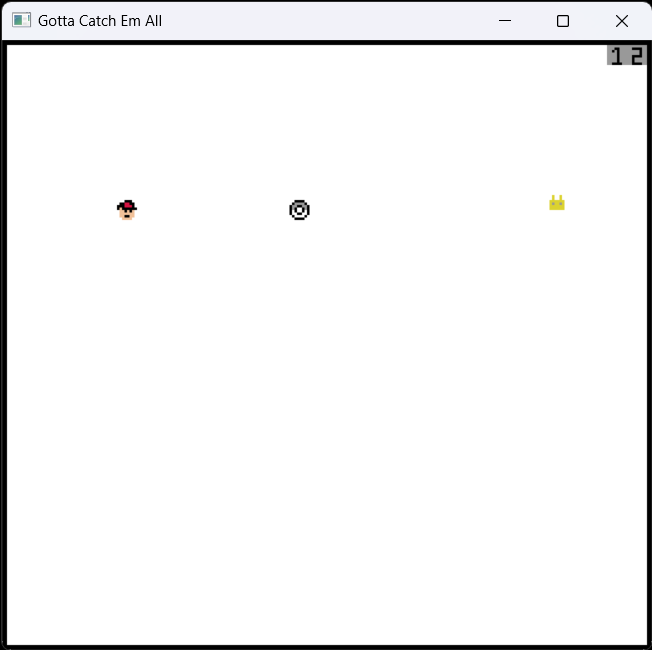

# Gotta Catch em All

Author: Sizhe Chen

Design: A game where you control Ash to catch pokemons with your pokemon balls. You can checkout your score with scoreboard on your top right!

Screen Shot:

How Your Asset Pipeline Works:

1. created assets through pixel art and put them in the corresponding folder
2. used load_png function to tranform png data to array of color vectors
2. implemented a function where given tile table index and palette table index, the function scan through the color array and  
fill in corresponding tile table and palette table
4. create sprites using these indexes

How To Play:

W, A, S, D for movement.

Space to send out your Poke Balls!

Note: You only have one poke ball and scoreboard display is not perfect... :(

This game was built with [NEST](NEST.md).

